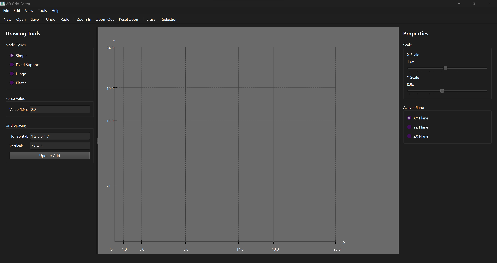
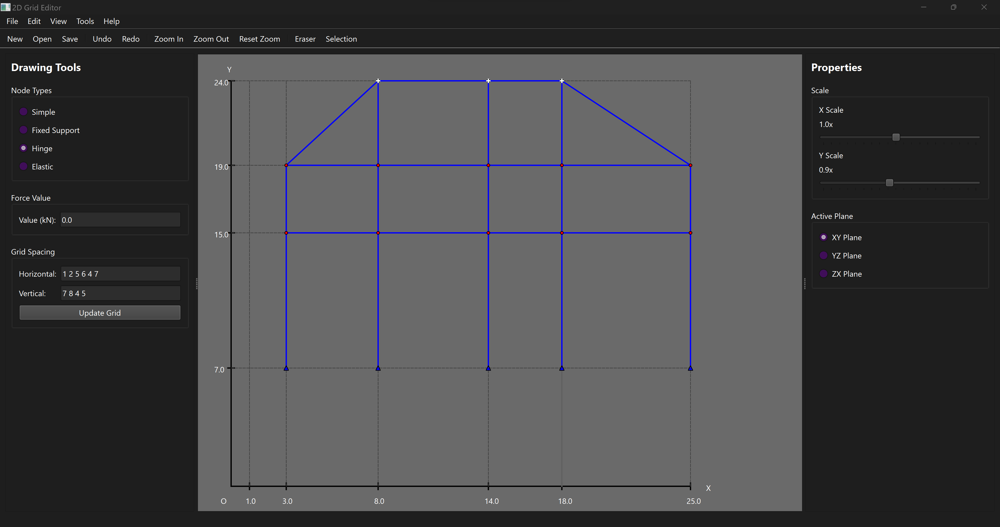

# 2D Grid Editor




A powerful and intuitive 2D grid editor built with PyQt6, designed for creating and manipulating grid-based layouts with advanced features.

## Features

- **Interactive Grid Editing**: Create and modify grid layouts with an intuitive interface
- **Multiple View Modes**: Support for different planes (XY, YZ) and viewing modes
- **Advanced Tools**:
  - Selection tool
  - Eraser tool
  - Force application
  - Grid customization
- **View Controls**:
  - Zoom in/out functionality
  - Grid visibility toggle
  - Background color customization
  - Fullscreen and Zen modes
- **File Operations**:
  - Save/Load projects
  - Export functionality
  - Undo/Redo support

## Requirements

- Python 3.x
- PyQt6

## Installation

1. Clone the repository:
```bash
git clone [your-repository-url]
```

2. Install the required dependencies:
```bash
pip install PyQt6
```

## Usage

Run the application:
```bash
python main.py
```

### Basic Controls

- **File Operations**:
  - New: Create a new project
  - Open: Load an existing project
  - Save: Save current project
  - Save As: Save project with a new name
  - Export: Export project data

- **View Controls**:
  - Zoom In/Out: Adjust view magnification
  - Grid Toggle: Show/hide grid (Shortcut: G)
  - Fullscreen: Toggle fullscreen mode
  - Zen Mode: Toggle distraction-free mode (Shortcut: Z)

- **Edit Operations**:
  - Undo/Redo: Revert or reapply changes
  - Clear All: Reset the current project

## Project Structure

```
├── main.py              # Application entry point
├── src/
│   ├── main_window.py   # Main application window
│   ├── grid_view.py     # Grid visualization component
│   ├── panels/          # UI panels
│   ├── models/          # Data models
│   ├── dialogs/         # Dialog windows
│   └── utils/           # Utility functions
```

## Contributing

Contributions are welcome! Please feel free to submit a Pull Request.

## License

[Your chosen license]

## Contact

[Your contact information] 